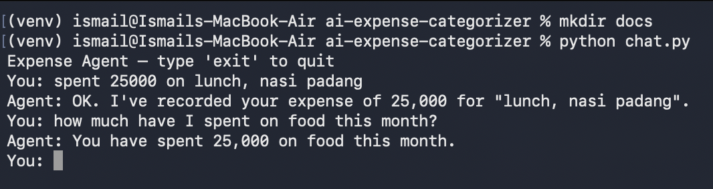

# Expense Agent

Track your monthly expenses just by talking to it — no forms, no dropdowns. Describe what you spent, and an AI agent figures out what to do: save it, categorize it, sum it up, or delete it.

## Demo

## Why I built this

I'm building this as part of my transition into software engineering — starting from the fundamentals and working up toward AI + backend development. This project started as a simple REST API for categorizing expenses, and I later rebuilt it into a conversational agent using Gemini's function calling. It's the first project where I actually built an agent loop from scratch instead of using a framework, so I could understand what's happening under the hood before relying on something like LangChain.

## Example

You: "spent 25000 on lunch, nasi padang"
Agent: OK, recorded Rp25,000 for lunch (nasi padang).

You: "how much have I spent on food this month?"
Agent: Total spending on Food category is Rp25,000.

You: "delete that nasi padang expense"
Agent: Deleted the "nasi padang" expense (ID 2).

The last one is the interesting part — to delete by description, the agent first has to look up the expense list, find the matching ID, and *then* call delete. That's two tool calls chained together, decided by the model itself, not by any `if "delete" in message` logic on my end.

## How the agent loop works

1. User sends a message.
2. Gemini either replies with plain text, or asks to call one of the tools I defined (`save_expense`, `get_all_expenses`, `get_total_by_category`, `delete_expense`).
3. If it's a tool call, my code executes the actual Python function — Gemini never touches the database directly, it can only ask.
4. The result gets sent back to Gemini.
5. Gemini decides whether it needs another tool call or has enough to give a final answer. Repeat until it returns plain text.

Along the way, I had to work through some SDK-specific quirks — like how `google.genai` requires tools to be declared as `types.FunctionDeclaration` + `types.Tool` objects instead of passing raw dicts directly, and how responses come back as a nested structure (`response.candidates[0].content.parts[0]`) rather than a flat object.

## Design Decisions

Why no LangChain?

I intentionally built the agent loop directly on top of the Gemini SDK.

My goal was to understand:

- how function calling actually works
- how tool execution is orchestrated
- how multi-step reasoning happens
- how responses flow between the model and Python

Once I understand these fundamentals, adopting higher-level frameworks becomes much easier.

## Bugs I actually ran into (and why they mattered)

I'm keeping this section because I think it says more about the project than a feature list does.

- **Silent dictionary unpacking bug.** I had `category, confidence = categorizer_expense(...)`, assuming it returned a tuple. It actually returns a dict with 2 keys. Unpacking a 2-key dict into 2 variables doesn't error — it just assigns the *key names* (`"category"`, `"confidence"`) instead of the values. No crash, just silently wrong data. Fixed by accessing values explicitly with `result["category"]`.
- **Parameter name mismatch.** My tool schema declared `expense_id`, but the actual `delete_expense()` function expects `id`. Gemini dutifully sent `expense_id`, and Python threw `TypeError: unexpected keyword argument`. Fixed the schema to match the real function signature, then wrote a pytest test using `inspect.signature()` to catch this kind of mismatch automatically for all 4 tools, not just this one.
- **`get_all_expenses()` returns tuples, not dicts.** Found this while writing a test for `delete_expense` — `expenses[0]["id"]` failed with `TypeError: tuple indices must be integers`. Had to index by position (`expenses[0][0]`) instead. Noted as a TODO to make this more robust later.

## Tech Stack

Python 3.14, Gemini API (`google-genai`) for categorization and function calling, FastAPI for the REST layer, SQLite for storage, pytest for testing.

## Project Structure

ai-expense-categorizer/
├── categorizer.py       # normalize_amount, categorize_expense
├── database.py           # init_db, save_expense, get_all_expenses,
                           #get_total_by_category, update_expense, delete_expense
├── agent.py               # describe_tools, build_tools, run_agent (the agent loop)
├── main.py                 # CLI entry point
├── main_api.py             # FastAPI entry point
├── test_agent.py            # tool schemas vs actual function signatures
├── test_database.py         # CRUD operations against an isolated test DB
├── requirements.txt
├── README.md

## Setup & Run

git clone https://github.com/Ssmailoo/ai-expense-categorizer.git
cd ai-expense-categorizer
python3 -m venv venv
source venv/bin/activate
pip install -r requirements.txt

Add a `.env` file:

GEMINI_API_KEY=your_api_key_here

Run the REST API:

uvicorn main_api:app --reload

Docs at `http://127.0.0.1:8000/docs`.

Run the agent (chat CLI):
python chat.py

## Tests

pytest -v

Tests cover:

✔ CRUD operations

✔ isolated SQLite database

✔ tool schema matches Python signatures

✔ category totals

✔ delete behavior

## REST API Endpoints

### `GET /expenses`
Returns all saved expenses.
[
  {
    "id": 2,
    "description": "makan siang",
    "amount": 25000,
    "category": "Food",
    "confidence": "high",
    "created_at": "2026-07-27 20:16:16"
  }
]

### `POST /expenses`
Categorizes and saves a new expense.

// request
{ "description": "makan siang", "amount": "25000" }

// response
{ "message": "Expense Saved", "category": "Food", "confidence": "high" }

### `GET /expenses/total/{category}`
`GET /expenses/total/Food`
{ "category": "Food", "total": 25000 }

### `PUT /expenses/{id}`
`PUT /expenses/1` with body `{ "category": "Self Reward" }` →

{ "message": "expense 1 update" }

### `DELETE /expenses/{id}`
`DELETE /expenses/1`

{ "message": "this expense 1 success deleted" }

## Live Demo

## Live Demo

🔗 [Try it live](https://ai-expense-categorizer-production.up.railway.app/docs)

The database resets on redeploy — feel free to add, list, or delete a few test expenses.

## Notes

- Amounts are stored as integers (IDR, no decimals).
- Confidence is marked `low` for ambiguous descriptions instead of guessing silently intentional, not a bug.

## What's next

- Expose the agent via a proper `/agent/chat` endpoint instead of just CLI
- Make `get_all_expenses` return dicts instead of raw tuples
- Bring `update_expense` (PUT) into the agent's toolset
- More test coverage around categorization consistency for ambiguous descriptions

[Ismail](https://github.com/Ssmailoo)
